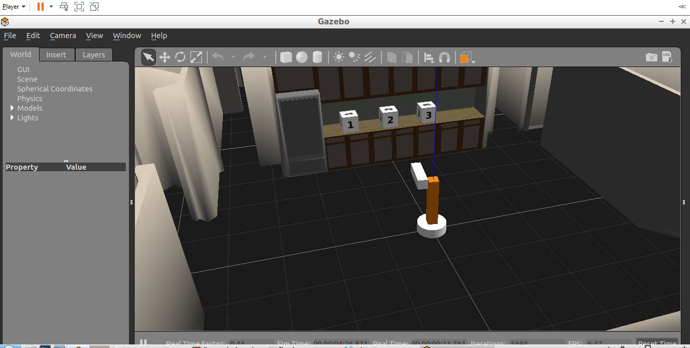
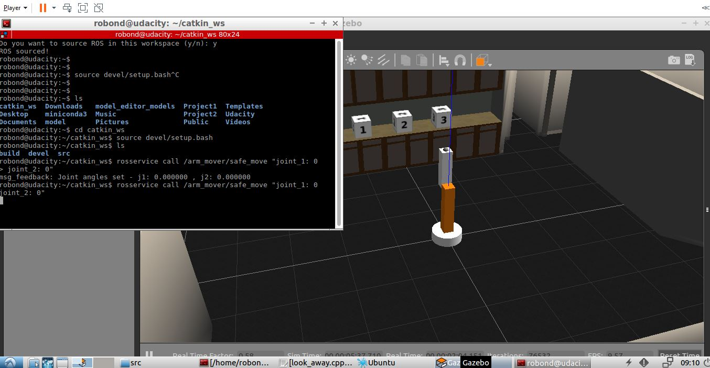

# Udacity-Arm_mover
Simple Arm_Mover in gazebo
<p>
  Uses the simple arm ROS package to make a robot model with 2 joints. The catkin package structure is used here along with gazebo engine.
 </p>

<h2> Working </h2>
Initially when the robot's joints (2 joints) is in 0,0 radians angle, the camera points to the sky og the environment.
Whenever the camera points to sky (Uniform pixels (gray) in image) and arm is not moving the GoToPosition service is called and the Arm is moved 90 degress or 1.57 radians
in both joints. Now the camera can clearly see the dice infront of the robot.

<h2> Installation Instructions </h2>
```
\\Move to catkin_ws inside the package
catkin_make
source devel/setup.bash
roslaunch simple_arm robot_spawn.launch

\\Now open another terminal and move to save path
source devel/setup.bash
rosservice call /arm_mover/safe_move "joint_1: 0
joint_2: 0"

\\This moves the robot to 0,0 and automatically it will go to 90,90
```


<p align="center">
<h3> The arm is moved to 90 degress in both the joints.</h3>
  
  
  
  <h3> Initial position of arm 0 degress in both the joints.</h3>
  
</p>
